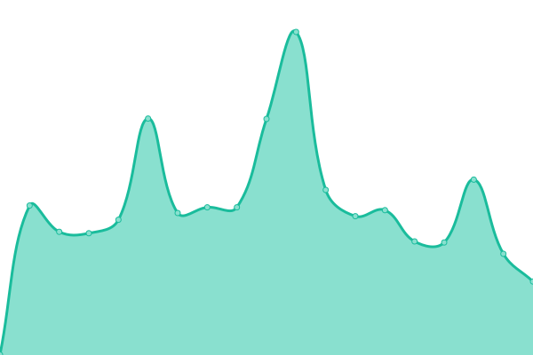

# [📈 Live Status](https:///Status): <!--live status--> **🟧 Partial outage**

This repository contains the open-source uptime monitor and status page for [kevlopzz](https:///Status), powered by [Upptime](https://github.com/upptime/upptime).

With [Upptime](https://upptime.js.org), you can get your own unlimited and free uptime monitor and status page, powered entirely by a GitHub repository. We use [Issues](https://github.com/kevlopzz/Status/issues) as incident reports, [Actions](https://github.com/kevlopzz/Status/actions) as uptime monitors, and [Pages](https:///Status) for the status page.

<!--start: status pages-->
<!-- This summary is generated by Upptime (https://github.com/upptime/upptime) -->
<!-- Do not edit this manually, your changes will be overwritten -->
<!-- prettier-ignore -->
| URL | Status | History | Response Time | Uptime |
| --- | ------ | ------- | ------------- | ------ |
|  [NateTech](https://www.natetech.dev) | 🟥 Down | [nate-tech.yml](https://github.com/kevlopzz/Status/commits/HEAD/history/nate-tech.yml) | 

 0ms
     
 | 

<a href="https://kevlopzz.github.io/Status/history/nate-tech">0.00%</a>
    

|  [Aneudy Adames](https://www.aneudyadames.dev) | 🟥 Down | [aneudy-adames.yml](https://github.com/kevlopzz/Status/commits/HEAD/history/aneudy-adames.yml) | 

 527ms
     
 | 

<a href="https://kevlopzz.github.io/Status/history/aneudy-adames">98.00%</a>
    

|  [Just Married](https://just-married.us/) | 🟩 Up | [just-married.yml](https://github.com/kevlopzz/Status/commits/HEAD/history/just-married.yml) | 

 282ms
     
 | 

<a href="https://kevlopzz.github.io/Status/history/just-married">100.00%</a>
    

|  [Test Broken Site](https://thissitedoesnotexist.koj.co) | 🟥 Down | [test-broken-site.yml](https://github.com/kevlopzz/Status/commits/HEAD/history/test-broken-site.yml) | 

 0ms
     
 | 

<a href="https://kevlopzz.github.io/Status/history/test-broken-site">100.00%</a>
    

<!--end: status pages-->

[**Visit our status website →**](https:///Status)

## 📄 License

- Powered by: [Upptime](https://github.com/upptime/upptime)
- Code: [MIT](./LICENSE) © [kevlopzz](https:///Status)
- Data in the `./history` directory: [Open Database License](https://opendatacommons.org/licenses/odbl/1-0/)
